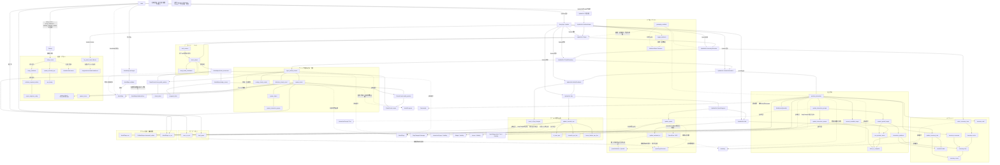

```mermaid
flowchart TD
    Main["main"]
    App["Bevy App / Update"]
    WorldPrototype["WorldMap::prototype"]
    ValidateWorldMap["WorldMap::validate"]
    WorldMap["WorldMap Resource"]
    ValidationErrors["WorldMapValidationError"]
    Startup["Startup"]
    UpdateOrder["UpdateSet の実行順"]
    SetNotebook["UpdateSet::NotebookInput"]
    SetPlayer["UpdateSet::Player"]
    SetInventory["UpdateSet::InventorySelection"]
    SetChunks["UpdateSet::ChunkStreaming"]
    SetInteraction["UpdateSet::InteractionActions"]
    SetFeedback["UpdateSet::WorldFeedback"]
    SetNpc["UpdateSet::Npc"]
    SetQuest["UpdateSet::QuestProgress"]
    SetHud["UpdateSet::Hud"]

    Main -->|"呼び出し"| WorldPrototype
    WorldPrototype --> ValidateWorldMap
    ValidateWorldMap -->|"成功"| WorldMap
    ValidateWorldMap -.->|"失敗時に詳細を表示して停止"| ValidationErrors
    Main -->|"System登録"| App
    Main -->|"setup_scene → setup_notebook → validate_required_entities を登録"| Startup
    Main -->|"UpdateSetをchainで設定"| UpdateOrder
    UpdateOrder --> SetNotebook --> SetPlayer --> SetInventory --> SetChunks --> SetInteraction --> SetFeedback --> SetNpc --> SetQuest --> SetHud
    Main -.->|"WorldMapを挿入"| WorldMap

    subgraph 起動とアセット["起動・アセット"]
        Setup["setup_scene"]
        SetupNotebook["setup_notebook"]
        Validate["validate_required_entities"]
        Report["report_singleton_entity"]
        SpawnNpc["spawn_riverside_npc"]
        SpawnHouseNpc["spawn_object / HouseBuilderNpc"]
        SpawnHouse["spawn_house"]
        NpcFacing["npc_facing"]
        AssetErrors["log_asset_load_failures"]
        RenderAssets["WorldRenderAssets"]
        AssetFailureEvent["UntypedAssetLoadFailedEvent"]
    end

    Startup -->|"順番に実行"| Setup
    Setup -->|"次に実行"| SetupNotebook
    SetupNotebook -->|"次に実行"| Validate
    Setup --> SpawnNpc
    SpawnNpc --> NpcFacing
    SpawnChunk --> SpawnHouseNpc
    SpawnChunk --> SpawnHouse
    Validate --> Report
    App -->|"Update System"| AssetErrors
    Setup -.->|"生成・登録"| RenderAssets
    AssetErrors -.->|"失敗イベントを読む"| AssetFailureEvent

    subgraph プレイヤー["プレイヤー・カメラ"]
        Orbit["orbit_camera"]
        Move["move_player"]
        Wrap["wrap_world_coordinate"]
    end

    App -->|"System登録"| SetPlayer
    SetPlayer --> Orbit
    SetPlayer --> Move
    Orbit -->|"同一Set内で先に実行"| Move
    Move --> Wrap
    Move -->|"通行判定"| Blocks["WorldMap::blocks_movement"]
    Move -.->|"読み取り"| Flags["WorldFlags"]
    Blocks --> ChunkFromPosition["ChunkCoord::from_world_position"]
    ChunkFromPosition --> ChunkIndex["chunk_index"]
    Blocks --> WrappedDelta["wrapped_delta"]
    Blocks --> BridgeCovers["WorldMap::bridge_covers"]
    BridgeCovers --> WorldPosition["ChunkCoord::world_position"]
    WorldPosition --> ChunkCenter["ChunkCoord::center"]
    Blocks --> ChunkCenter
    BridgeCovers --> WrappedDelta
    Blocks -.->|"地形・配置定義"| WorldMap["WorldMap"]

    subgraph インベントリ["インベントリ"]
        SelectItem["select_inventory_item"]
        Select["Inventory::select"]
        HasItem["Inventory::has"]
        CountItem["Inventory::count"]
        AddItem["Inventory::add"]
        ConsumeItem["Inventory::consume"]
        ItemLabel["ItemKind::label"]
        InventoryHud["update_inventory_hud"]
    end

    App -->|"System登録"| SetInventory
    SetInventory --> SelectItem
    SelectItem --> Select
    Select --> HasItem
    HasItem --> CountItem
    ConsumeItem --> HasItem
    App -->|"System登録"| SetHud
    SetHud --> InventoryHud
    InventoryHud --> CountItem
    InventoryHud --> ItemLabel
    SelectItem -.->|"読み書き"| Inventory["Inventory"]
    InventoryHud -.->|"読み取り"| Inventory

    subgraph チャンク["チャンクの読み込み・生成"]
        SyncChunks["sync_loaded_chunks"]
        Nearby["nearby_chunk_coords"]
        DefinitionCoord["definition_chunk_coord"]
        SpawnChunk["spawn_chunk"]
        SpawnObject["spawn_object"]
        SpawnPopup["spawn_interaction_popup"]
    end

    App -->|"System登録"| SetChunks
    SetChunks --> SyncChunks
    SyncChunks --> ChunkFromPosition
    SyncChunks --> Nearby
    SyncChunks --> DefinitionCoord
    SyncChunks --> SpawnChunk
    SyncChunks -.->|"参照・生成対象"| WorldMap
    SyncChunks -.->|"読み取り"| Flags
    SyncChunks -.->|"読み取り"| Progress["WorldProgress"]
    SpawnChunk --> WorldPosition
    SpawnChunk --> SpawnObject
    SpawnObject --> SpawnPopup
    SpawnChunk -.->|"チャンク定義"| WorldMap
    SpawnChunk -.->|"取得・伐採・完成状態を反映"| Progress
    SpawnChunk -.->|"完成状態を反映"| Flags

    subgraph 相互作用["相互作用"]
        Perform["perform_interaction"]
        NearestAvailable["nearest_available_target"]
        Prompt["update_interaction_prompt"]
        NearestGuided["nearest_guided_target"]
        Guidance["interaction_guidance"]
        CanPerform["can_perform_action"]
        IsComplete["action_is_complete"]
        BuildQuest["BuildQuest(QuestId)"]
        Popups["update_interaction_popups"]
    end

    App -->|"System登録"| SetInteraction
    SetInteraction --> Perform --> Prompt --> Popups
    Perform --> NearestAvailable
    NearestAvailable --> CanPerform
    CanPerform --> IsComplete
    Perform --> AddItem
    Perform --> ConsumeItem
    Perform --> FlagWrite
    Perform --> BuildQuest
    Prompt --> NearestGuided
    NearestGuided --> Guidance
    NearestGuided --> CanPerform
    Guidance --> IsComplete
    Guidance --> ItemLabel
    Guidance --> HasItem
    Popups --> IsComplete
    Perform -.->|"読み書き"| Inventory
    Perform -.->|"読み書き"| Flags
    Perform -.->|"読み書き"| Progress
    Perform -.->|"FlagChangedを書き込み"| FlagChanged["FlagChanged Message"]
    Perform -.->|"対象Entityをdespawn"| EntityCommands["Commands"]
    Prompt -.->|"表示更新"| InteractionPrompt["InteractionPrompt / Text"]
    Popups -.->|"表示更新"| InteractionPopup["InteractionPopup / Visibility"]

    subgraph ワールド反映["ワールド状態の反映"]
        ReactFlags["react_to_flag_changes"]
        NpcUpdate["update_riverside_npc"]
        NearNpc["is_near_npc"]
        NpcLine["riverside_npc_line"]
        HouseNpcLine["house_builder_npc_line"]
    end

    App -->|"System登録"| SetFeedback
    SetFeedback --> ReactFlags
    App -->|"System登録"| SetNpc
    SetNpc --> NpcUpdate
    ReactFlags -.->|"FlagChangedを読む"| FlagChanged
    ReactFlags -.->|"橋の表示を更新"| Bridge["Bridge / Visibility"]
    ReactFlags -.->|"完成した家を表示"| House["House / Visibility"]
    NpcUpdate --> NearNpc
    NpcUpdate --> NpcLine
    NpcUpdate --> HouseNpcLine
    NpcUpdate -.->|"読み取り"| Flags
    NpcUpdate -.->|"表示更新"| DialogueHud["NpcDialogueHud / Text / Visibility"]

    subgraph メモ帳とクエスト["メモ帳・クエスト"]
        ToggleNotebook["toggle_notebook"]
        GameplayEnabled["gameplay_enabled"]
        UpdateQuests["update_quests"]
        UpdateNotebook["update_notebook_ui"]
        QuestDefinitions["QuestDefinition / QuestId"]
        QuestGiver["QuestGiver / NPC"]
        QuestLog["QuestLog Resource"]
        NotebookState["NotebookState Resource"]
    end

    SetNotebook --> ToggleNotebook
    ToggleNotebook -.->|"開閉・操作停止"| NotebookState
    GameplayEnabled -.->|"状態を読む"| NotebookState
    GameplayEnabled -.->|"移動・道具選択・作業を制御"| SetPlayer
    GameplayEnabled -.-> SetInventory
    GameplayEnabled -.-> Perform
    SetQuest --> UpdateQuests
    UpdateQuests --> NearNpc
    UpdateQuests -.->|"QuestIdごとのNPC接近を確認"| QuestGiver
    UpdateQuests -.->|"開始IDを保持"| QuestLog
    UpdateQuests -.->|"完成状態を読む"| Flags
    SetHud --> UpdateNotebook
    UpdateNotebook -.->|"橋・家の必要品と進行を読む"| QuestDefinitions
    UpdateNotebook -.->|"進行を読む"| QuestLog
    UpdateNotebook -.->|"所持数を読む"| Inventory
    Perform -.->|"材料の確認と消費"| QuestDefinitions

    subgraph 保存["セーブ・ロード"]
        LoadGame["load_game"]
        SaveOnExit["save_on_exit"]
    end

    Main --> LoadGame
    Main -->|"終了時"| SaveOnExit
    LoadGame -.->|"開始済みIDを復元"| QuestLog
    SaveOnExit -.->|"開始済みIDを保存"| QuestLog

    subgraph ワールド定義["ワールド定義・補助関数"]
        ColliderRadius["ColliderShape::horizontal_radius"]
        FlagRead["WorldFlags::is_set"]
        FlagWrite["WorldFlags::set"]
    end

    NearestAvailable -.-> ColliderRadius
    NearestGuided -.-> ColliderRadius
    Popups -.-> ColliderRadius
    Move --> FlagRead
    SpawnChunk --> FlagRead
    Perform --> FlagWrite
    NpcUpdate --> FlagRead

    LegendCall["実線: 登録・実行順・関数呼び出し"]
    LegendData["点線: Resource / Message / Entityデータの参照・更新"]
```
